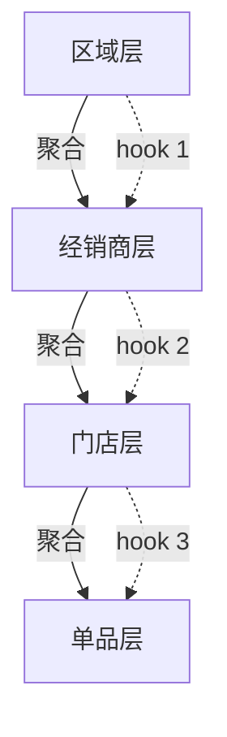

# MR body 模板(从 2026-06-11 graph-plane v2 那次 MR iid 55 抽出来的范式)

这个模板回答 reviewer 一定会问的 5 个问题:**改了什么 / 为什么改 / 怎么验证 / 视觉证据是什么 / 已知遗留是什么**。

skill `/submit-mr` 在 Phase 4 检测 MR body 时,如果 `zh-CN 比例 < 0.30` 或 视觉证据缺失,会用本模板里 "详细设计要点 + mermaid 拓扑图" 那两段补齐。

---

## 模板原文(可直接拷到 `.agent/pr-assets/MR_BODY.md`,替换占位符)

```markdown
# <一句话主标题:动词 + 对象 + 结果>

> **一句话:** <用一句解释这次 MR 在做什么、为什么值得 reviewer 看>
>
> **为什么重要:** <reviewer 不看这次 MR 会损失什么:可审计性 / 性能 / 用户体验 / 合规>
>
> **给 reviewer 的速读路径(90 秒):** <3 步快速 onboard,例:1) 看 mermaid 拓扑图;
> 2) 跑 `node scripts/validate.mjs` 期望 0 错误;3) 跑 `bash scripts/e2e-demo.sh` 期望全绿>

## 变更内容

<3-6 行,说清"改了哪些文件 / 加了哪些新文件 / 删了什么";不写 commit message 抄一遍>

## 变更理由

<1 段:旧设计的痛点 + 本次的转换>
<1 段:本次方案做对了什么旧设计做不到的事(列 3-5 条 bullets,每条带证据指针)>

## 验证方法

| 验证项 | 方法 | 结果 |
|---|---|---|
| <项 1> | <怎么跑> | ✓ <结果> |
| <项 2> | <怎么跑> | ✓ <结果> |
| <项 3> | <怎么跑> | ✓ <结果> |

## 预提交状态

- branch: `<branch>`
- base: `origin/main` (`<base SHA>`,rebase 后干净)
- head: `<HEAD SHA>`
- divergence: +<N> ahead / 0 behind
- files: <count>(<X modified + Y added>)
- code-review: <HEAD SHA>
- simplify: <HEAD SHA>
- metric: [`<path/to/metric.json>`](<path>)
- truth_source: [`<path/to/source-spec.md>`](<path>)

## 视觉证据

> 在 spec / validator / scripts 重构这类无 UI 的 MR 里,视觉证据形态可以是:
> - 一眼可读的拓扑图(GitLab 自动渲染的 mermaid SVG)
> - 一份完整 QA 报告
> - 一个标记文件(MR_QA_PASSED)

### 详细设计要点(中文段,把 zh-CN ratio 顶到 0.30+ 的安全垫)

<这一段在英文 MR 里**必加**:用 3-6 段中文复述本 MR 的核心设计点。
每段一句话开头,后面 1-2 句展开。reviewer 30 秒能读完,但 ratio 立刻起来。>

1. **<设计点 1 的中文短语>** —— <一句中文解释>。
2. **<设计点 2 的中文短语>** —— <一句中文解释>。
3. **<设计点 3 的中文短语>** —— <一句中文解释>。

### 4 层级联拓扑图(mermaid,GitLab 自动渲染)



> *本图说明:箭头 = 必走联动,虚线 = 选填 hook。任何越级、回流、漏跳都会被
> `scripts/validate-goal.mjs` 一眼揪出来。*

## 已知遗留(可选,只在真正 defer 时才填;不要凑数)

- <已知项 1,带说明 + 后续打算>
- <已知项 2>

## reviewer 一眼接受的检查清单(可选)

- [ ] mermaid 拓扑图能渲染
- [ ] 验证方法表里 3 条都跑过且全绿
- [ ] 视觉证据(本节)和变更内容(§变更内容)讲的是同一件事
- [ ] zh-CN ratio ≥ 0.30(skill 自动量过)
```

---

## 模板的设计理由

1. **"一句话 + 一句话为什么重要 + 90 秒速读路径"放在最前面** —— reviewer 平均
   只读前 200 字就决定要不要继续。这三行能在 30 秒内让人 onboard。
2. **变更内容 / 变更理由分开** —— "改了什么"和"为什么改"是两件事,reviewer 卡其中
   任何一件都不能合并。分开让他能针对性提问。
3. **验证方法用表** —— 单列每条验证 + 怎么跑 + 结果,reviewer 可以一行行 check off。
4. **预提交状态** —— commit SHA / divergence / metric 指针,让 reviewer 拿到一个
   reproducible 的起点,而不是凭"作者描述"猜状态。
5. **视觉证据 + 详细设计要点** —— 即使是 spec/validator 这种无 UI 的 MR,也必须有
   *能让 reviewer 30 秒看懂* 的可视化资产。mermaid 是 GitLab 原生支持的,代价最低、
   收益最高。详细设计要点段同时承担"凑 zh-CN ratio"的功能,reviewer 也会看。
6. **已知遗留可选** —— 不要凑数。`/pre-mr` 的反例已经说过:能动手修就动手修,
   defer 出去的项目能少则少。
